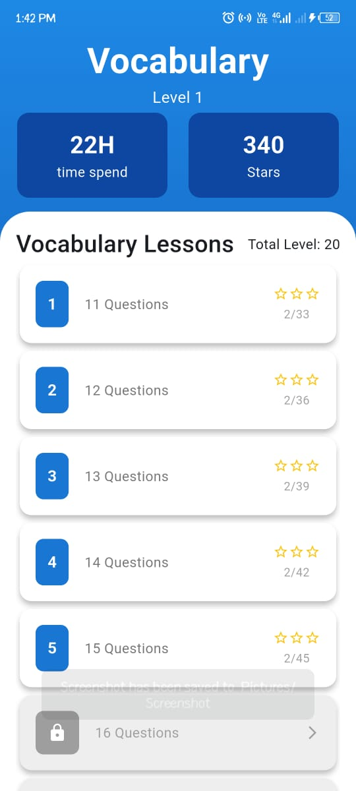

# Vocaboo - Language Learning App

Vocaboo is a sleek, interactive Flutter-based language learning app designed for modern learners. Focused on intuitive UI/UX and effective progress tracking, it helps users master vocabulary, grammar, speaking, and listening in multiple languages with gamified progression.

---

## 🚀 Features

- **Multiple Language Support**
- **Vocabulary, Grammar, Speaking, Listening Modules**
- **Level-based Progression (1-20)**
- **Stars & Time-based Tracking**
- **Daily Streak & Leaderboard**
- **Audio Playback with Waveform**
- **Voice Input for Speaking Practice**
- **Offline Grammar Content via CSV Assets**

---

## 🔧 Tech Stack

- **Flutter** (UI Framework)
- **Firebase** (Auth & Firestore)
- **Supabase** (Content Caching & User Stats)
- **FastAPI** (Custom Content Generator Backend)
- **just\_audio + just\_waveform** (Audio Playback)
- **Provider** (State Management)

---

## 📅 UI Previews

> ### Onboarding Screen

<p float="left">
  
  
  
</p>

> ### Login and Signup Screens

<p flaot="left">
    
    
</p>

> ### 🌐 Home Screen
<p flaot="left">
    
    
</p>

> ### 🔢 Vocabulary Detail
<p flaot="left">
    
    
</p>

> ### 🔊 Listening Practice

>

> ### 🌐 Grammar Detail (Parsed Locally)
<p flaot="left">
    
    
    
    
</p>

>
> ### ⬆️ Progress & Leaderboard
<p flaot="left">
    
    
</p>

> ### ⬆️ Settings and Info


---

## 🛠️ Setup & Run

1. **Clone the Repository:**

```bash
git clone https://github.com/yourname/vocaboo.git
cd vocaboo
```

2. **Install Dependencies:**

```bash
flutter pub get
```

3. **Set Up Firebase:**

- Add your `google-services.json` and `GoogleService-Info.plist` for Android and iOS respectively.
- Ensure Firebase Auth and Firestore are enabled.

4. **Run the App:**

```bash
flutter run
```

---

## 📂 Assets & Structure

```
lib/
|-- models/
|-- provider/
|-- screens/
|-- utils/
|-- widgets/
assets/
|-- csv/
|   |-- grammar_data.csv
|-- audio/
|-- flags/
|-- screenshots/
```

---

## 🚫 Disclaimer

Vocaboo is a work in progress and currently optimized for educational and demo purposes. Open-source release is pending.

---

## 🚀 Upcoming Improvements

- OCR-based Word Extraction
- AI-Powered Speaking Evaluation
- Document Scanner Module (Post-v1.0)

---

## 🙏 Contributing / Feedback

Feel free to suggest improvements or contribute via issues or pull requests.

---

*Developed with ❤️ by Waleed Qamar*

